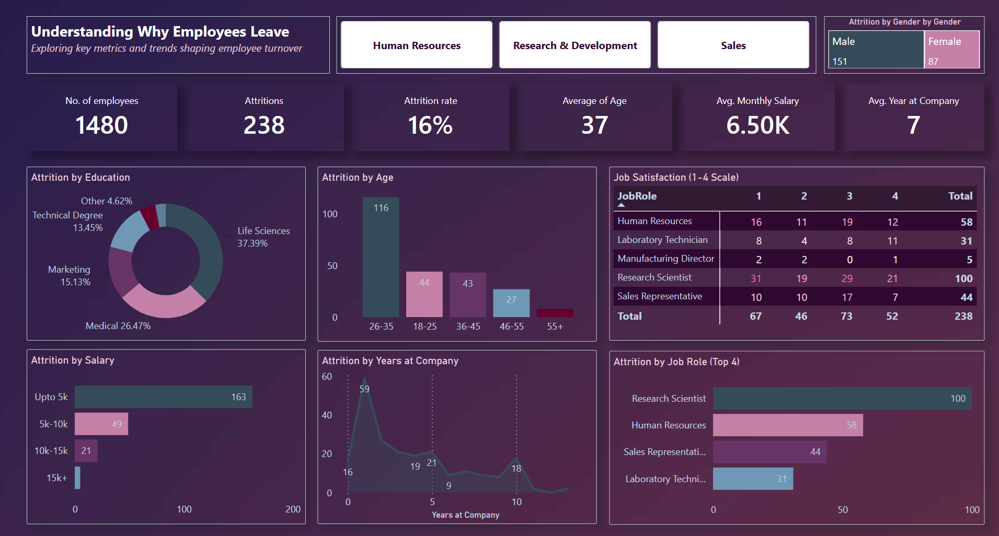

# HR Attrition Analysis Dashboard

## Executive Summary

This project analyzes employee attrition within a corporate workforce to understand the patterns, pressure points, and demographic factors influencing why employees leave. Using Power BI, I examined **1,480 employees**, of whom **238 (16%)** exited the organization.

The analysis reveals five major insights:

- **Early‑career employees (26–35)** experience the highest attrition.
- **Lower salaries strongly correlate with turnover**, with 163 departures from employees earning under 5K monthly.
- **Tenure plays a major role**, with attrition peaking in the first year and again between 3–5 years.
- **Certain job roles face higher turnover**, especially Research Scientists, HR, and Sales.
- **Education background influences attrition**, with Life Sciences and Medical fields accounting for over 60% of exits.

These findings highlight the importance of targeted retention strategies, competitive compensation, and role‑specific interventions to reduce workforce turnover.

---

## Business Problem

Employee attrition affects productivity, morale, and organizational stability. The company needed to answer the following questions:

- Which employee groups are most likely to leave?
- How do age, salary, education, and tenure influence attrition?
- Which job roles experience the highest turnover?
- What patterns can help predict and prevent future exits?

The goal of this analysis was to transform raw HR data into actionable insights that support better workforce planning and retention strategies.

---

## Project Objectives & Hypotheses

### Objectives

- Evaluate attrition across demographics, salary, tenure, and job roles.
- Identify high‑risk employee segments.
- Assess the impact of compensation and tenure on turnover.
- Visualize attrition trends using Power BI.
- Provide data‑driven recommendations for HR decision‑making.

### Hypotheses

- Early‑career employees are more likely to leave.
- Lower salaries contribute significantly to attrition.
- Certain job roles experience higher turnover due to workload or market competition.
- Tenure influences attrition, with early exits and mid‑career transitions being most common.

---

## Methodology

### Data Preparation

- Cleaned and validated HR employee records.
- Standardized age groups, salary bands, and tenure categories.
- Created key metrics:
  - Attrition Count
  - Attrition Rate
  - Average Monthly Income
  - Average Tenure

### Employee Segmentation

#### Age Groups
- 18–25  
- 26–35  
- 36–45  
- 46–55  
- 55+

#### Salary Bands
- Up to 5K  
- 5K–10K  
- 10K–15K  
- 15K+

#### Tenure Categories
- 0 years  
- 1 year  
- 3–5 years  
- 8–10 years  

### Analytical Techniques

- Descriptive Statistics  
- Attrition Rate Analysis  
- Demographic Segmentation  
- Job Role Breakdown  
- Trend & Distribution Analysis  
- Data Storytelling  

### Tools Used

- **Power BI**
  - Data Modeling  
  - DAX Measures  
  - Interactive Visualizations  
  - Storytelling Layouts  

---

# Key Insights

## 1. Age-Based Attrition Patterns

.png)
Employees aged **26–35** accounted for nearly **half of all attrition**, indicating early‑career instability and high expectations for growth.

- **18–25:** High early‑career turnover  
- **26–35:** Highest attrition overall  
- **36–45:** Moderate attrition  
- **46–55 & 55+:** Lowest attrition  

### Business Insight  
Retention strategies should prioritize early‑career development, mentorship, and career progression pathways.

---

## 2. Salary and Attrition

Salary emerged as one of the strongest predictors of attrition.

- **163 departures** were from employees earning **under 5K** monthly.  
- Attrition decreases significantly as salary increases.

### Business Insight  
Competitive compensation and value‑aligned benefits can reduce turnover, especially among lower‑income employees.

---

## 3. Tenure and Attrition

Attrition spikes at two critical points:

- **First year:** 59 exits  
- **3–5 years:** Another major wave  

### Business Insight  
Early onboarding support and mid‑career growth opportunities are essential for retention.

---

## 4. Job Role Attrition

Certain roles experience significantly higher turnover:

- **Research Scientists:** 100 exits  
- **Human Resources:** 58  
- **Sales Representatives:** 44  

### Business Insight  
High‑pressure or competitive roles require targeted retention strategies, workload balancing, and career development support.

---

## 5. Education and Attrition

Employees with **Life Sciences** and **Medical** backgrounds accounted for over **60%** of attrition.

### Business Insight  
Role expectations, external opportunities, and workload may influence attrition in specialized fields.

---

# Recommendations

## 1. Strengthen Early‑Career Support

Focus on:

- Onboarding programs  
- Mentorship  
- Clear growth pathways  

---

## 2. Improve Compensation for Lower Salary Bands

Examples:

- Salary adjustments  
- Performance bonuses  
- Value‑driven benefits  

---

## 3. Target High‑Risk Job Roles

Approaches:

- Workload balancing  
- Role-specific incentives  
- Career development plans  

---

## 4. Enhance Mid‑Career Retention

Focus on:

- Leadership training  
- Internal mobility programs  
- Skill development opportunities  

---

## 5. Tailor Strategies by Education Background

Potential approaches:

- Specialized retention programs  
- Clear role expectations  
- Professional development support  

---

# Conclusion

This analysis demonstrates that employee attrition is shaped by demographic, financial, and role‑specific factors. One pattern remains clear:

> Employees leave when expectations, compensation, or career growth do not align with their needs.

By adopting targeted retention strategies, organizations can reduce turnover, strengthen employee satisfaction, and build a more stable workforce.

---

## Dataset

**Source:** IBM HR Analytics Employee Attrition Dataset  
Used for educational and analytical purposes.

---

## About the Analyst

### Alex Ssendege

Accounting & Finance professional transitioning into **Data Analytics**, **Business Intelligence**, and **Performance Analysis**.

Passionate about transforming data into actionable insights that support better decision‑making and organizational growth.

📧 **Email:** ssendege26@gmail.com  
🔗 **LinkedIn:** https://www.linkedin.com/in/alex-ssendege/  
💻 **GitHub:** https://github.com/alex-ssendege  
🌐 **Portfolio:** https://alexssendege.my.canva.site/
